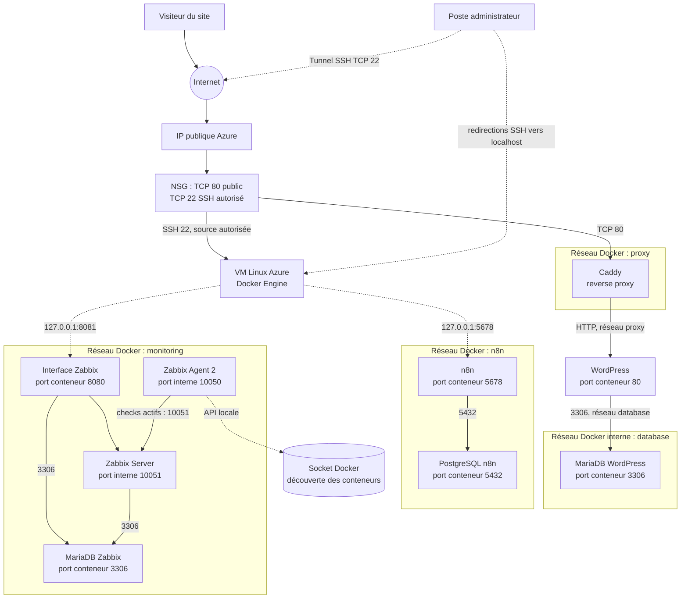

# Groupe 1 — WordPress, n8n et Zabbix

Le dépôt déploie une pile Docker Compose sur une VM Linux Azure déjà créée. Le script ne crée, ne redimensionne et ne supprime aucune VM. Le déploiement se fait uniquement avec Bash et Docker Compose ; Azure CLI n’est pas requis sur la VM.

## Architecture

| Service | Rôle | Accès |
| --- | --- | --- |
| Caddy | Reverse proxy HTTP | Seul service web exposé ; port TCP 80 |
| WordPress | Site public | Derrière Caddy |
| MariaDB | Base WordPress | Réseau Docker privé |
| n8n et PostgreSQL | Automatisations et base n8n | Interface privée sur le port local 5678 |
| Zabbix Server, interface web et MariaDB | Supervision et base Zabbix | Interface privée sur le port local 8081 |
| Zabbix Agent 2 | Découverte et métriques des conteneurs Docker du projet | Réseau interne Zabbix, port TCP 10050 |

Les interfaces n8n et Zabbix ne sont pas routées par Caddy et ne sont pas accessibles depuis Internet. L’agent et le serveur Zabbix communiquent sur leur réseau Docker privé ; aucun port Zabbix n’est publié sur la VM. Les bases de données ne publient aucun port.



Le socket Docker donne à l’agent la visibilité sur les conteneurs du moteur de la VM. Pour ne découvrir que ceux du projet, ne faites pas tourner d’autres projets sur le même moteur Docker. Les ports `5678` et `8081` sont attachés à `127.0.0.1` sur la VM et se testent depuis le poste via un tunnel SSH ; le port `80` de Caddy est le seul port applicatif destiné à Internet.

L’agent Zabbix est configuré pour superviser les conteneurs Docker uniquement : il a accès à l’API Docker via son socket, mais ne partage pas le PID, `/proc`, `/sys` ni la racine de l’hôte. Il doit néanmoins s’exécuter en root pour accéder au socket Docker ; le montage de celui-ci en lecture seule n’empêche pas l’usage de l’API Docker. N’exposez jamais ce socket ni les interfaces privées à Internet. Cette découverte concerne tous les conteneurs visibles par le moteur Docker de la VM ; pour garder la supervision limitée à ce projet, déployez-le sur un moteur Docker dédié à cette pile.

## Préparer la configuration

Sur la VM Linux, installez Docker avec Compose v2, puis copiez le modèle de configuration :

```bash
cp .env.example .env
```

## Déployer

Depuis la racine du dépôt sur la VM, lancez :

```bash
bash ./deploy.sh
```

Le script vérifie le fichier `.env`, ouvre TCP 80 dans UFW si ce pare-feu est actif, démarre les services et vérifie que Caddy/WordPress répond en local. Il n’a besoin ni d’Azure CLI, ni d’identité managée, et ne modifie pas le pare-feu Azure.

Dans le **portail Azure**, vérifiez d’abord qu’une adresse IP publique est associée à la VM. Sur le NSG associé à son interface réseau ou son sous-réseau, ajoutez une règle entrante **TCP 80**, source `Any`, destination `Any`, action `Allow`, pour rendre WordPress public. Aucun port Zabbix n’est à ouvrir dans Azure. Ne publiez pas les ports `5678` et `8081`.

n8n reste volontairement privé et annonce ses URL d’éditeur/webhook sous `localhost:5678` ; des services externes ne pourront donc pas appeler ses webhooks entrants.

## Tester les services

Sur la VM, vérifie d’abord l’état des conteneurs et teste les trois interfaces HTTP en local :

```bash
docker compose ps
curl -sSI --max-time 10 http://127.0.0.1/
curl -sSI --max-time 10 http://127.0.0.1:5678/
curl -sSI --max-time 10 http://127.0.0.1:8081/
```

- **Caddy et WordPress** : la première requête passe par le reverse proxy ; une réponse `200` ou une redirection `301`/`302` est attendue. Un `302` vers `/wp-admin/install.php` signifie que WordPress attend encore son installation initiale. Vérifie la configuration Caddy avec `docker compose exec reverse-proxy caddy validate --config /etc/caddy/Caddyfile --adapter caddyfile`.
- **n8n** : l’interface doit répondre sur `127.0.0.1:5678`. Pour le navigateur depuis ton poste, ouvre le tunnel SSH ci-dessous puis va sur `http://localhost:5678`.
- **Zabbix** : l’interface web doit répondre sur `127.0.0.1:8081`. Ouvre le même tunnel SSH puis va sur `http://localhost:8081`. Identifiants initiaux habituels : `Admin` / `zabbix` ; change le mot de passe après connexion.

Depuis le poste d’administration, crée un tunnel SSH vers la VM (garde cette session ouverte) :

```bash
ssh -L 5678:127.0.0.1:5678 -L 8081:127.0.0.1:8081 utilisateur@IP_PUBLIQUE
```

Dans Zabbix, configure l’hôte `groupe1-wordpress-vm` avec une interface **DNS** `zabbix-agent`, port `10050`, et associe uniquement **Docker by Zabbix agent 2**. Dans **Monitoring → Latest data**, sélectionne cet hôte et vérifie la découverte des conteneurs et les items Docker. Le port agent est privé au réseau Compose ; aucun port Zabbix n’est à ouvrir dans Azure.

Pour confirmer que seules les interfaces prévues sont publiées, vérifie `docker compose ps` : Caddy publie le port `80`, n8n `127.0.0.1:5678`, l’interface Zabbix `127.0.0.1:8081`. Le serveur Zabbix, son agent et les bases ne doivent pas avoir de port hôte publié.

## Accéder aux interfaces privées

- **VM Azure :** créez un tunnel SSH depuis votre poste, en remplaçant l’adresse par l’adresse publique de la VM :

  ```sh
  ssh -L 5678:127.0.0.1:5678 -L 8081:127.0.0.1:8081 azureuser@ADRESSE_PUBLIQUE
  ```

  Laissez le tunnel actif, puis ouvrez les mêmes adresses `localhost` dans le navigateur.
- WordPress est accessible sur `http://ADRESSE_DE_LA_MACHINE`. Dans Zabbix, changez le mot de passe initial `Admin` / `zabbix`.
- Lors de la première visite de n8n, créez le compte propriétaire.

WordPress utilise actuellement HTTP uniquement : accédez à `http://IP_PUBLIQUE`, pas à `https://IP_PUBLIQUE`. Pour distinguer un problème du reverse proxy d’un blocage Azure, `curl -I http://127.0.0.1/` sur la VM doit retourner une réponse WordPress (souvent `302` vers l’installation initiale). Si ce test marche localement mais pas depuis Internet, vérifiez l’IP publique, le NSG effectif, puis le pare-feu de l’hôte ; le reverse proxy fonctionne alors et le blocage est en amont de la VM.

## Superviser les conteneurs de cette VM avec Zabbix

L’agent local annonce par défaut le nom `groupe1-wordpress-vm` (ou la valeur configurée dans `ZABBIX_HOSTNAME`). Dans l’interface Zabbix, configure cet hôte avec une interface Agent de type **DNS**, nom `zabbix-agent`, port `10050`. Ce nom Docker est résolu par le serveur Zabbix sur le réseau Compose `monitoring`. Associe **uniquement** le modèle **Docker by Zabbix agent 2** ; ne lie pas de modèle Linux si la VM elle-même ne doit pas être supervisée.

L’agent reçoit uniquement le socket Docker : il ne partage pas le PID, `/proc`, `/sys` ni la racine de l’hôte. Il peut découvrir les conteneurs du moteur Docker de cette VM, c’est-à-dire les conteneurs de la pile du projet si aucun autre projet ne tourne sur ce moteur. Le socket Docker confère des privilèges élevés ; ne l’expose pas à l’extérieur.

## Arrêter et conserver les données

Depuis le répertoire du projet :

```sh
docker compose down
```

Les volumes nommés conservent les données WordPress, n8n et Zabbix. `docker compose down -v` supprime aussi ces données ; ne l’utilisez que si leur effacement est voulu.
