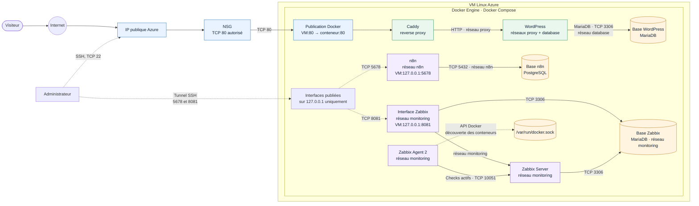

# Groupe 1 — WordPress, n8n et Zabbix

Le dépôt déploie une pile Docker Compose sur une VM Linux Azure déjà créée. Le script ne crée, ne redimensionne et ne supprime aucune VM. Le déploiement se fait uniquement avec Bash et Docker Compose ; Azure CLI n’est pas requis sur la VM.

## Architecture

| Service | Rôle | Accès |
| --- | --- | --- |
| Caddy | Reverse proxy HTTP | Seul service web exposé ; port TCP 80 |
| WordPress | Site public | Derrière Caddy |
| MariaDB | Base WordPress | Réseau Docker privé |
| n8n et PostgreSQL | Automatisations et base n8n | Interface privée sur le port local 5678 |
| Zabbix Server, interface web et MariaDB | Supervision et base Zabbix | Interface privée sur le port local 8081 |
| Zabbix Agent 2 | Découverte et métriques des conteneurs Docker du projet | Réseau interne Zabbix, port TCP 10050 |

Les interfaces n8n et Zabbix ne sont pas routées par Caddy et ne sont pas accessibles depuis Internet. L’agent et le serveur Zabbix communiquent sur leur réseau Docker privé ; aucun port Zabbix n’est publié sur la VM. Les bases de données ne publient aucun port.



Le socket Docker donne à l’agent la visibilité sur les conteneurs du moteur de la VM. Pour ne découvrir que ceux du projet, ne faites pas tourner d’autres projets sur le même moteur Docker. Les ports `5678` et `8081` sont attachés à `127.0.0.1` sur la VM et se testent depuis le poste via un tunnel SSH ; le port `80` de Caddy est le seul port applicatif destiné à Internet.

L’agent Zabbix est configuré pour superviser les conteneurs Docker uniquement : il a accès à l’API Docker via son socket, mais ne partage pas le PID, `/proc`, `/sys` ni la racine de l’hôte. Il doit néanmoins s’exécuter en root pour accéder au socket Docker ; le montage de celui-ci en lecture seule n’empêche pas l’usage de l’API Docker. N’exposez jamais ce socket ni les interfaces privées à Internet. Cette découverte concerne tous les conteneurs visibles par le moteur Docker de la VM ; pour garder la supervision limitée à ce projet, déployez-le sur un moteur Docker dédié à cette pile.

## Préparer la configuration

Sur la VM Linux, installez Docker avec Compose v2, puis copiez le modèle de configuration :

```bash
cp .env.example .env
```

## Déployer

Depuis la racine du dépôt sur la VM, lancez :

```bash
bash ./deploy.sh
```

Le script vérifie le fichier `.env`, ouvre TCP 80 dans UFW si ce pare-feu est actif, démarre les services et vérifie que Caddy/WordPress répond en local. Il n’a besoin ni d’Azure CLI, ni d’identité managée, et ne modifie pas le pare-feu Azure.

Dans le **portail Azure**, vérifiez d’abord qu’une adresse IP publique est associée à la VM. Sur le NSG associé à son interface réseau ou son sous-réseau, ajoutez une règle entrante **TCP 80**, source `Any`, destination `Any`, action `Allow`, pour rendre WordPress public. Aucun port Zabbix n’est à ouvrir dans Azure. Ne publiez pas les ports `5678` et `8081`.

n8n reste volontairement privé et annonce ses URL d’éditeur/webhook sous `localhost:5678` ; des services externes ne pourront donc pas appeler ses webhooks entrants.

## Arrêter

Depuis le répertoire du projet :

```sh
docker compose down
```
